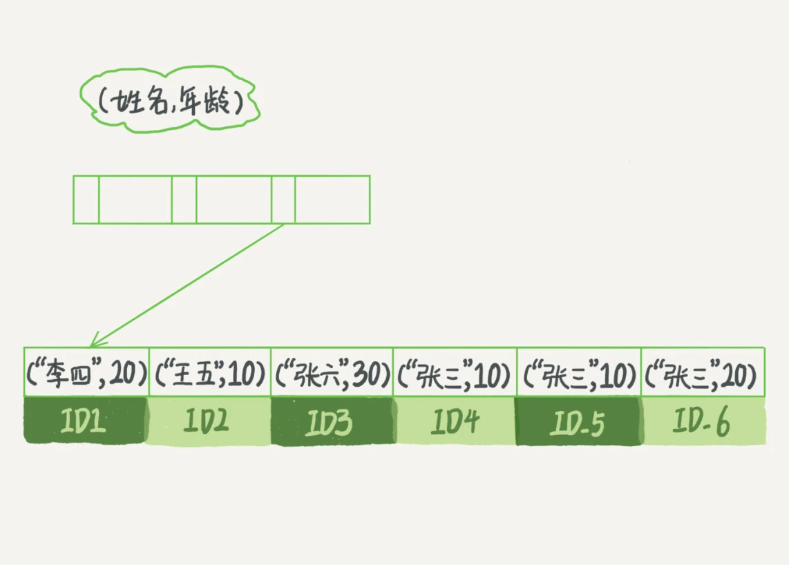

```json
{
  "date": "2024.03.14 21:21",
  "title": "索引(2)"
}
```

#### 开篇点题

在下面这个表 T 中，如果我执行 select * from T where k between 3 and 5，需要执行几次树的搜索操作，会扫描多少行？

答案: 会执行5次树搜索操作,k树会扫描3行,3 5 6, 3和5搜索并回表 

回表:从辅助索引回到主键索引树搜索的过程,我们称为回表。

#### 索引优化,避免回表


覆盖索引:
如果执行的语句是 select ID from T where k between 3 and 5，这时只需要查 ID 的值，而 ID 的值已经在 k 索引树上了，因此可以直接提供查询结果，不需要回表。也就是说，在这个查询里面，索引 k 已经“覆盖了”我们的查询需求，我们称为覆盖索引。

- 由于可以减少树的搜索次数,显著提升查询性能。所以使用覆盖索引是一个常用的性能优化手段。


联合索引: 如果某几个字段绑定了联合索引,那么在树上就能直接查到这些字段,就不用回表到主树了。缺点(更高成本更多空间)


#### 最左前缀原则
最左前缀原则是干嘛的呢，很简单，就是为了解决“为一个不频繁的请求创建一个索引感觉很浪费”的问题的。



如果你要查的是所有名字第一个字是“张”的人，你的 SQL 语句的条件是"where name like ‘张 %’"。这时，你也能够用上这个索引，查找到第一个符合条件的记录是 ID3，然后向后遍历，直到不满足条件为止。

可以看到，不只是索引的全部定义，只要满足最左前缀，就可以利用索引来加速检索。这个最左前缀可以是联合索引的最左 N 个字段，也可以是字符串索引的最左 M 个字符。

基于上面对最左前缀索引的说明，我们来讨论一个问题：在建立联合索引的时候，如何安排索引内的字段顺序。


#### 索引下推

- 在搜索遍历过程中,对索引中包含的字段先做判断,直接过滤不满足记录,减少回表次数。


#### 小结

```sql
CREATE TABLE `geek` (
  `a` int(11) NOT NULL,
  `b` int(11) NOT NULL,
  `c` int(11) NOT NULL,
  `d` int(11) NOT NULL,
  PRIMARY KEY (`a`,`b`),
  KEY `c` (`c`),
  KEY `ca` (`c`,`a`),
  KEY `cb` (`c`,`b`)
) ENGINE=InnoDB;
```

公司的同事告诉他说，由于历史原因，这个表需要 a、b 做联合主键，这个小吕理解了。但是，学过本章内容的小吕又纳闷了，既然主键包含了 a、b 这两个字段，那意味着单独在字段 c 上创建一个索引，就已经包含了三个字段了呀，为什么要创建“ca”“cb”这两个索引？
同事告诉他，是因为他们的业务里面有这样的两种语句：
```sql

select * from geek where c=N order by a limit 1;
select * from geek where c=N order by b limit 1;

```

答案: 对于二级索引c,会默认和主键做联合索引。所以索引c排序:cab,索引cb就是cba,
所以结论是 ca可以去掉, cba不能去掉。 
这两条语句都需要回表: c 和 a回表,可以走ab,根据最左原则c和b回表,索引就失效了。


